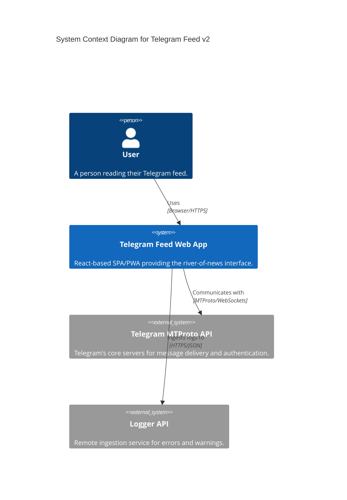
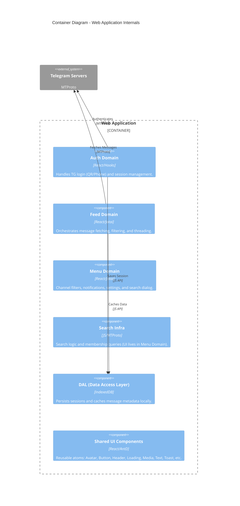
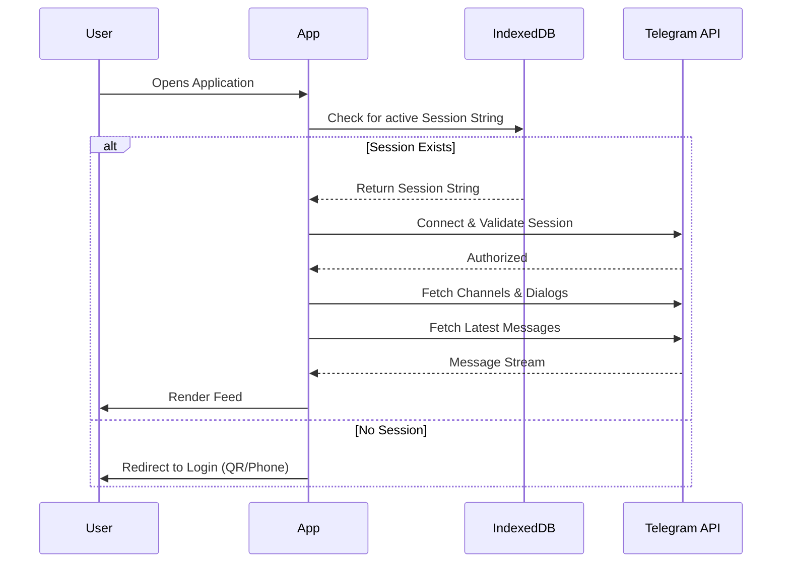

# Telegram Feed v2 Architecture

This document provides a detailed technical overview of the Telegram Feed v2 application, its components, 3rd-party integrations, and deployment strategy.

## 1. System Overview

Telegram Feed v2 is a specialized Telegram client designed as a "river of news" feed. It focuses on consolidating messages from multiple channels into a single, cohesive reading experience, departing from the traditional chat-list abstraction.

The application is a **frontend-only** (Single Page Application / PWA) that communicates directly with Telegram's MTProto servers via the browser.

### High-Level System Context

---

## 2. Technical Stack

| Category | Technology |
| :--- | :--- |
| **Framework** | React 19 |
| **Build Tool** | Vite (Rolldown) |
| **State Management** | Jotai (Atoms) |
| **UI Components** | Ant Design (v6) |
| **Telegram API** | `telegram` (Browser MTProto client) |
| **Local Storage** | IndexedDB (via custom DAL) |
| **Avatar Carousel** | Embla Carousel |
| **PWA** | Service Worker with auto-update |
| **Formatter** | Biome |
| **Linter** | oxlint |
| **Deployment** | Contabo VPS (Docker + SSH) |
| **Containerization** | Docker |

---

## 3. Application Architecture

The application follows a domain-driven structure, isolating concerns like authentication, data access (DAL), and the core feed logic.

### Internal Container Diagram

### Sequence: Authentication & Feed Initialization

This diagram illustrates how the app resumes a session and starts fetching the feed.

### Theme System

The app detects the OS preference (`prefers-color-scheme`) and applies Ant Design's `darkAlgorithm` or `defaultAlgorithm` accordingly. The base font size is fixed at `16px` via `ConfigProvider`. Theme changes propagate to `document.body` styles via a `GlobalStyles` component.

---

## 4. 3rd-Party Services & APIs

### Telegram MTProto API
The primary service. Unlike the Bot API, this app uses the Client API, allowing it to act on behalf of a real user.
- **Protocol:** MTProto over WebSockets.
- **Authentication:** Supported via Phone Number (+ SMS/2FA) or QR Code.
- **Identifiers:** Requires `VITE_TELEGRAM_API_ID` and `VITE_TELEGRAM_API_HASH` obtained from [my.telegram.org](https://my.telegram.org).

### Logger API
Remote logging service for tracking runtime warnings and errors in non-development environments.
- **Endpoint:** `https://logger-api.fly.dev/ingest`
- **Authentication:** Token-based via `x-ingest-key`.

---

## 5. Deployment Details

### Infrastructure

The app is hosted on a **Contabo VPS** (`167.86.70.240`) and served at `telegram-feed.mlnkv.net`. Deployment is done manually over SSH: the Docker image is built and the container is updated on the server.

### Docker Strategy
The app uses a **multi-stage Docker build** to keep the production image lean:
1. **Build Stage:** Uses `node:22-alpine` to install dependencies and run `vite build`.
2. **Production Stage:** Uses `pierrezemb/gostatic` (approx. 5MB) to serve the `dist/` folder on port 8080.

### Environment Variables
Required at build time (for Vite):
- `VITE_TELEGRAM_API_ID`: Your Telegram App ID.
- `VITE_TELEGRAM_API_HASH`: Your Telegram App Hash.

---

## 6. Local Development

To run the project locally:

1. **Setup Env:** Create a `.env` file with your Telegram credentials.
2. **Install:** `npm install`
3. **Dev Server:** `npm run dev`
4. **Testing:** `npm test` to run Vitest suite.
