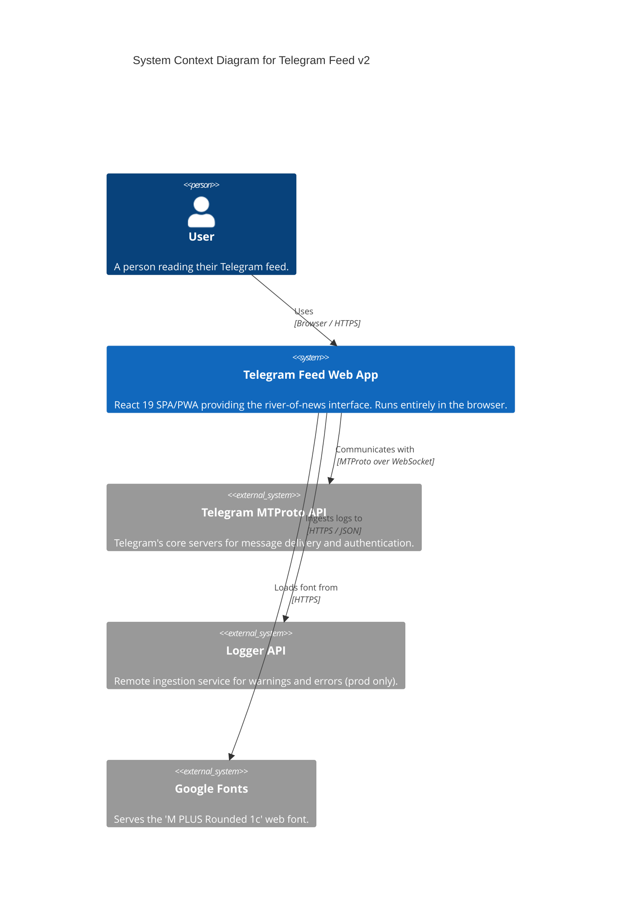
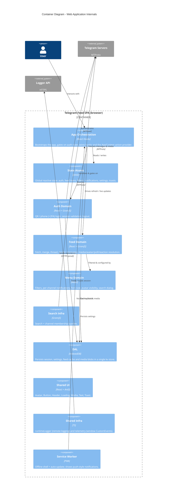
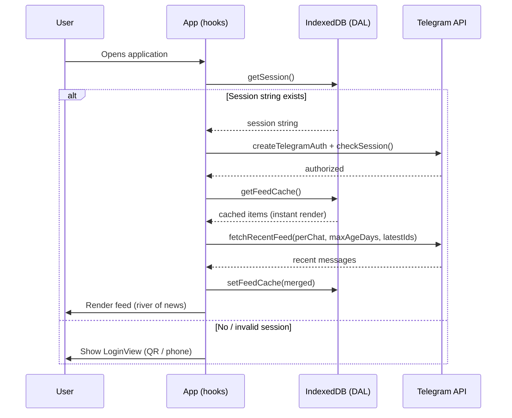
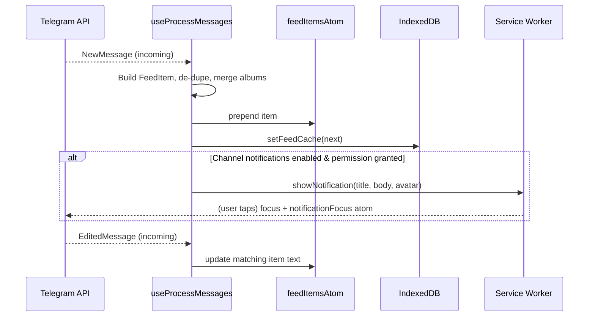

# Telegram Feed v2 Architecture

This document provides a detailed technical overview of the Telegram Feed v2 application, its components, 3rd-party integrations, and deployment strategy.

## 1. System Overview

Telegram Feed v2 is a specialized Telegram client designed as a "river of news" feed. It consolidates messages from multiple channels, groups and DMs into a single, cohesive reading experience, departing from the traditional chat-list abstraction.

The application is **frontend-only** (Single Page Application / PWA). It talks directly to Telegram's MTProto servers from the browser using the `telegram` (GramJS) client — there is no backend of our own. All user data (session, settings, cached feed, media blobs) lives locally in the browser's IndexedDB.

### High-Level System Context



---

## 2. Technical Stack

| Category | Technology |
| :--- | :--- |
| **Framework** | React 19 |
| **Language** | TypeScript |
| **Build Tool** | Vite — `rolldown-vite` (Rolldown bundler) |
| **Runtime / Package Manager** | Bun (lockfile `bun.lock`) |
| **State Management** | Jotai (atoms) + React Context for the authenticated app's action handlers |
| **UI Components** | Ant Design (v6) |
| **Telegram API** | `telegram` (GramJS, browser MTProto build) |
| **Local Storage** | IndexedDB (single `kv` store via custom DAL) |
| **List Virtualization** | `virtua` |
| **Avatar Carousel** | `embla-carousel-react` |
| **QR Login** | `qrcode` |
| **PWA** | Service Worker with auto-update |
| **Formatter** | Biome |
| **Linter** | oxlint |
| **Tests** | Vitest + Testing Library (unit/integration), Playwright (e2e) |
| **Component Sandbox** | Storybook (`@storybook/react-vite`) — see [storybook.md](storybook.md) |
| **Container** | Docker (multi-stage: Bun build → nginx serve) |
| **Deployment** | Contabo VPS over SSH |

---

## 3. Application Architecture

The codebase follows a **domain-driven** structure under `src/domains/`, with cross-cutting reusable UI/infra under `src/shared/` and global state under `src/atoms/`.

| Layer / Domain | Path | Responsibility |
| :--- | :--- | :--- |
| **App** | `src/domains/app` | Root orchestration: bootstrap, auth gating, hooks (`useTelegram`, `useAuthentication`, `useProcessMessages`, `useRefresh`, `useSettings`, `useNotificationFocus`), and the `AppContext` action provider. |
| **Auth** | `src/domains/auth` | Telegram login via QR or phone (+ 2FA), session creation/validation, logout. Infra wraps the GramJS client. |
| **Feed** | `src/domains/feed` | Fetching, merging, threading, media/avatar resolution, polls, reactions. Infra split into `telegramFeed.{query,actions,media,avatar,binary,shared}`. UI renders cards, threads, virtualized list. |
| **Menu** | `src/domains/menu` | Settings & dialogs: channel filters, per-channel notifications, font size, avatar visibility, search, maintenance. |
| **Search** | `src/domains/search` | MTProto search + channel membership queries (UI lives in the Menu domain). |
| **DAL** | `src/domains/dal` | IndexedDB key-value persistence: session, settings, feed cache, media blobs. |
| **Atoms** | `src/atoms` | Jotai global state (auth, feed items, filters, notifications, font size, toasts, etc.). |
| **Shared** | `src/shared` | Reusable UI atoms (Avatar, Button, Header, Loading, Media, Text, Toast) and infra (`runtimeLogger`, `telemetry`). |

### Internal Container Diagram



### Sequence: Session Resume & Feed Initialization

How the app resumes a stored session on load and renders the feed.



### Sequence: Realtime Updates & Notifications

`useProcessMessages` subscribes to live MTProto events once authenticated.



### State & Data Flow

- **Global state** lives in Jotai atoms (`src/atoms/`): `authClientAtom`/`isAuthenticatedAtom`, `feedItemsAtom`, `feedFiltersAtom`, `channelsAtom`, `notifications*`, `fontSizeAtom`, `avatarVisibilityAtom`, `toastsAtom`, etc.
- **Action handlers** (refresh, load older, send message, vote poll, toggle filters/notifications, logout, settings) are assembled in `AuthenticatedApp` and exposed to the tree via `AppContext`. Accessing the context outside its provider throws (Proxy guard in `AppContext.ts`).
- **Persistence** flows through the `Dal` interface (`src/domains/dal/types.ts`), implemented over a single IndexedDB `kv` store (`indexedDbDal.ts`). The feed renders from cache first, then reconciles with freshly fetched messages.

### Theme System

`src/main.tsx` reads `prefers-color-scheme` and selects one of two explicit Ant Design token sets — `defaultTokens` (light) or `darkTokens` (dark) — via `ConfigProvider`. Note the antd `darkAlgorithm`/`defaultAlgorithm` line is intentionally disabled; theming is driven entirely by the explicit token objects, which now define distinct light/dark base and surface colors. The base **font size is user-configurable** through `fontSizeAtom` (`FONT_SIZE_PX`), and a `GlobalStyles` component mirrors the active theme tokens onto `document.body`.

---

## 4. 3rd-Party Services & APIs

### Telegram MTProto API
The primary service. Unlike the Bot API, this app uses the **Client API** (GramJS), acting on behalf of a real user.
- **Protocol:** MTProto over WebSocket (browser build).
- **Authentication:** Phone number (+ SMS code / 2FA password) or QR code.
- **Identifiers:** Requires `VITE_TELEGRAM_API_ID` and `VITE_TELEGRAM_API_HASH` from [my.telegram.org](https://my.telegram.org).

### Logger API
Remote logging for warnings and errors, **active in non-debug builds only** (`runtimeLogger`).
- **Endpoint:** `https://logger-api.fly.dev/ingest`
- **Authentication:** `x-ingest-key` header.
- **Safety:** payload context is recursively scrubbed for sensitive keys (`phone`, `password`, `token`, `secret`, `session`, `credential`) before sending.

### Telemetry (internal)
`emitTelemetry` dispatches `telegram-feed:telemetry` `CustomEvent`s on `window` (e.g. `feed_refresh_completed`, `feed_load_older_failed`) for in-app observability. This is a client-side event bus — it does not send data off-device by itself.

---

## 5. Deployment Details

### Infrastructure
The app is hosted on a **Contabo VPS** (`167.86.70.240`) and served at `telegram-feed.mlnkv.net` (see `deploy.toml`). Deployment is performed manually over SSH: the Docker image is built and the container updated on the server.

### Docker Strategy
A **multi-stage Docker build** keeps the production image lean:
1. **Build stage** — `oven/bun:1-alpine`: installs deps with `bun install --frozen-lockfile`, then runs `bunx vite build`.
2. **Serve stage** — `nginx:alpine`: copies `dist/` into the nginx html root and applies `nginx.conf` (which sets the CSP, SPA fallback, etc.). Exposes port `8080`.

### Environment Variables
Required at build time (Vite inlines `VITE_*`):
- `VITE_TELEGRAM_API_ID`
- `VITE_TELEGRAM_API_HASH`
- `VITE_BASE_URL` *(optional — base path, defaults to `/`)*

---

## 6. Local Development

```sh
bun install        # or npm install
bun run dev        # Vite dev server
bun run test       # Vitest unit/integration suite
bun run lint       # oxlint
bun run storybook  # component sandbox on :6006
```

1. **Setup env:** create a `.env` file with your Telegram credentials.
2. **Install, run, test** as above.

See [storybook.md](storybook.md) for rendering the authenticated UI in isolation with mock data and capturing screenshots.
